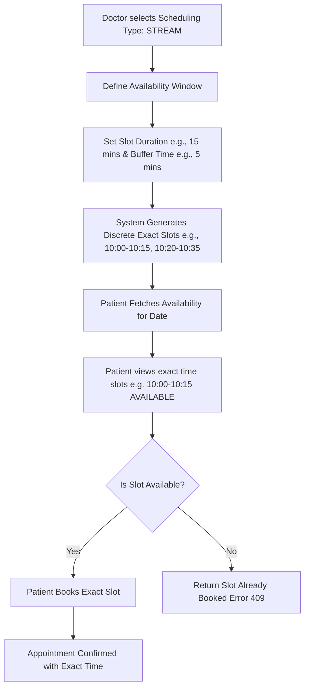
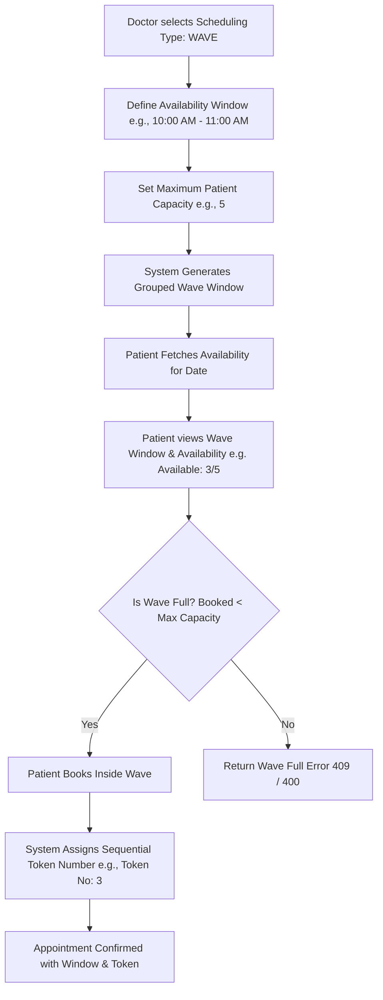

# Advanced Doctor Scheduling System - Flow Charts

This document presents the simple flowcharts for the **Stream Scheduling Strategy** and the **Wave Scheduling Strategy** in the Schedula Advanced Doctor Scheduling System.

---

## 1. Stream Scheduling Flow (Exact Appointment Time)

---

## 2. Wave Scheduling Flow (Token-Based Capacity)

---

## Flow Summary Table

| Feature | Stream Scheduling | Wave Scheduling |
|---|---|---|
| **Best For** | Psychologists, Dermatologists, Specialists | General Physicians, OPD Clinics, High Volume |
| **Time Structure** | Discrete exact start and end times | Grouped time window (e.g., 10 AM - 11 AM) |
| **Parameters** | `slotDuration`, `bufferTime` | `maxCapacity` / `timeWindow` |
| **Patient Confirmation** | Exact time (e.g. 10:00 AM - 10:15 AM) | Time window + Token Number (e.g. Token No: 3) |
| **Capacity Handling** | 1 patient per exact slot | Sequential token assignment up to `maxCapacity` |
