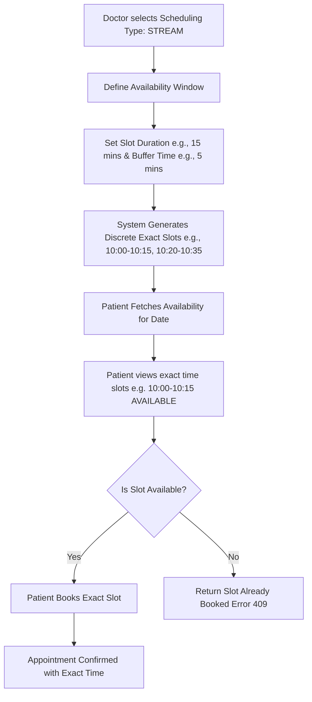
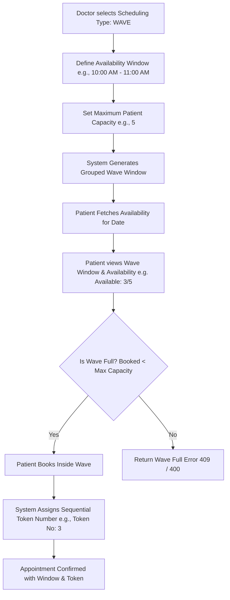
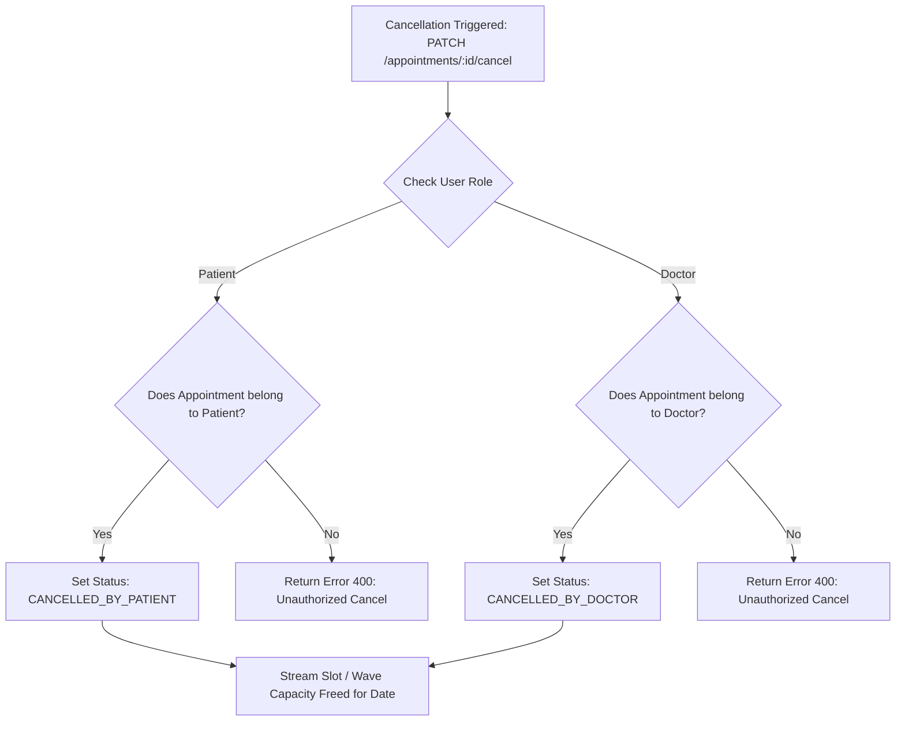
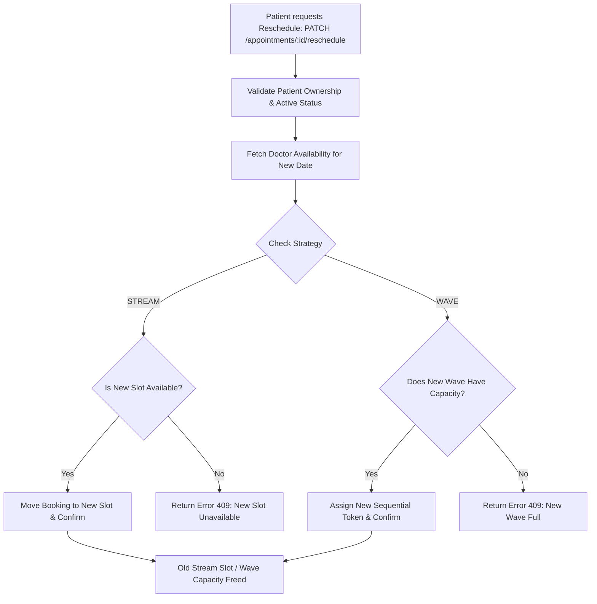

# Advanced Doctor Scheduling System - Flow Charts

This document presents the flowcharts for **Stream Scheduling**, **Wave Scheduling**, **Appointment Cancellation (Patient & Doctor)**, and **Patient Rescheduling** in the Schedula Advanced Doctor Scheduling System.

---

## 1. Stream Scheduling Flow (Exact Appointment Time)

```mermaid
flowchart TD
    A[Doctor selects Scheduling Type: STREAM] --> B[Define Availability Window]
    B --> C[Set Slot Duration e.g., 15 mins & Buffer Time e.g., 5 mins]
    C --> D[System Generates Discrete Exact Slots e.g., 10:00-10:15, 10:20-10:35]
    D --> E[Patient Fetches Availability for Date]
    E --> F[Patient views exact time slots e.g. 10:00-10:15 AVAILABLE]
    F --> G{Is Slot Available?}
    G -- Yes --> H[Patient Books Exact Slot]
    H --> I[Appointment Confirmed with Exact Time]
    G -- No --> J[Return Slot Already Booked Error 409]
```

---

## 2. Wave Scheduling Flow (Token-Based Capacity)

```mermaid
flowchart TD
    A[Doctor selects Scheduling Type: WAVE] --> B[Define Availability Window e.g., 10:00 AM - 11:00 AM]
    B --> C[Set Maximum Patient Capacity e.g., 5]
    C --> D[System Generates Grouped Wave Window]
    D --> E[Patient Fetches Availability for Date]
    E --> F[Patient views Wave Window & Availability e.g. Available: 3/5]
    F --> G{Is Wave Full? Booked < Max Capacity}
    G -- Yes --> H[Patient Books Inside Wave]
    H --> I[System Assigns Sequential Token Number e.g., Token No: 3]
    I --> J[Appointment Confirmed with Window & Token]
    G -- No --> K[Return Wave Full Error 409 / 400]
```

---

## 3. Cancellation Flow (Patient & Doctor)

```mermaid
flowchart TD
    A[Cancellation Triggered: PATCH /appointments/:id/cancel] --> B{Check User Role}
    B -- Patient --> C{Does Appointment belong to Patient?}
    C -- Yes --> D[Set Status: CANCELLED_BY_PATIENT]
    C -- No --> E[Return Error 400: Unauthorized Cancel]
    B -- Doctor --> F{Does Appointment belong to Doctor?}
    F -- Yes --> G[Set Status: CANCELLED_BY_DOCTOR]
    F -- No --> H[Return Error 400: Unauthorized Cancel]
    D --> I[Stream Slot / Wave Capacity Freed for Date]
    G --> I
```

---

## 4. Patient Rescheduling Flow

```mermaid
flowchart TD
    A[Patient requests Reschedule: PATCH /appointments/:id/reschedule] --> B[Validate Patient Ownership & Active Status]
    B --> C[Fetch Doctor Availability for New Date]
    C --> D{Check Strategy}
    D -- STREAM --> E{Is New Slot Available?}
    E -- Yes --> F[Move Booking to New Slot & Confirm]
    E -- No --> G[Return Error 409: New Slot Unavailable]
    D -- WAVE --> H{Does New Wave Have Capacity?}
    H -- Yes --> I[Assign New Sequential Token & Confirm]
    H -- No --> J[Return Error 409: New Wave Full]
    F --> K[Old Stream Slot / Wave Capacity Freed]
    I --> K
```

---

## Flow Summary Table

| Feature | Stream Scheduling | Wave Scheduling |
|---|---|---|
| **Best For** | Psychologists, Dermatologists, Specialists | General Physicians, OPD Clinics, High Volume |
| **Time Structure** | Discrete exact start and end times | Grouped time window (e.g., 10 AM - 11 AM) |
| **Parameters** | `slotDuration`, `bufferTime` | `maxCapacity` / `timeWindow` |
| **Patient Confirmation** | Exact time (e.g. 10:00 AM - 10:15 AM) | Time window + Token Number (e.g. Token No: 3) |
| **Capacity Handling** | 1 patient per exact slot | Sequential token assignment up to `maxCapacity` |
| **Cancellation** | Frees exact slot for rebooking | Increases available wave capacity |
| **Rescheduling** | Moves to new available Stream slot | Moves to new Wave window with new token |
