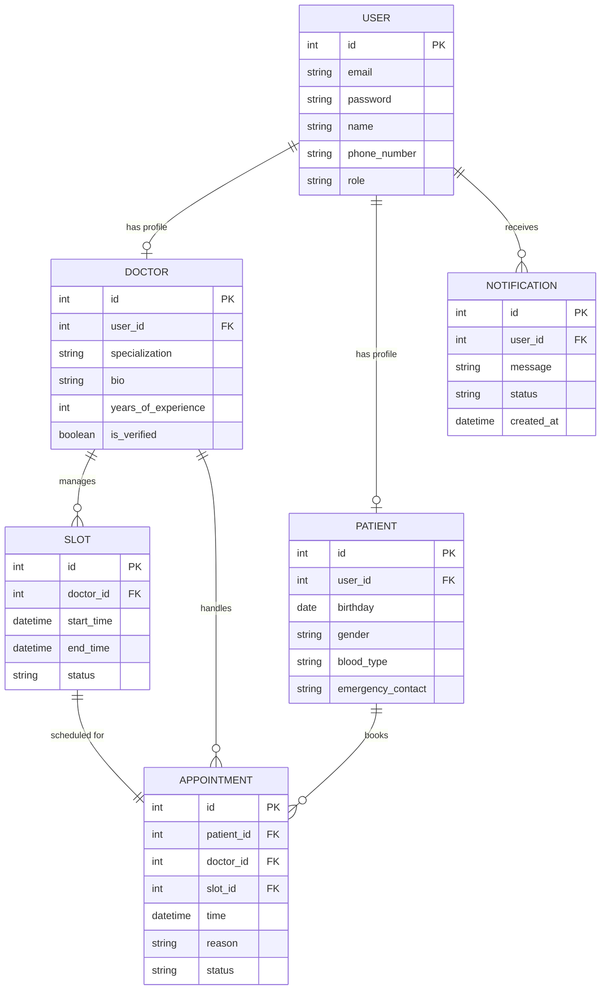

# Entity Relationship (ER) Diagram

You can view the detailed image at [Document/ER-DIAGRAM.png](Document/ER-DIAGRAM.png) and the raw source code in [Document/ER-DIAGRAM.mermaid](Document/ER-DIAGRAM.mermaid).

📝 Database Tables Explained
Our database keeps login details separate from profile details. Here is a simple explanation of how each table works:

1. Core Tables
User (Green):
What it does: This is the main login table for everyone.
How it works: When anyone signs up (doctor, patient, or admin), they get a row here. It stores their email, password, name, phone number, and role.
Doctor (Purple):
What it does: Stores details about doctors.
How it works: It connects directly to the User table. It stores their specialization, bio, years of experience, and if they are verified.
Patient (Blue):
What it does: Stores details about patients.
How it works: It also connects directly to the User table. It stores their birthday, gender, blood type, and emergency contact info.

2. Booking Tables
Slot (Orange):
What it does: Represents a doctor's free time slots.
How it works: A doctor can create free slots. Each slot has a start time, end time, and a status (like "AVAILABLE" or "BOOKED").
Appointment (Teal):
What it does: Tracks booked appointments.
How it works: It links a Patient, a Doctor, and a Slot together. It saves the appointment time, the reason for the visit, and the status (like "PENDING", "CONFIRMED", or "CANCELLED").

3. Alerts Table
Notification (Red):
What it does: Keeps track of messages sent to users.
How it works: When something happens (like an appointment is booked), the system creates a notification message linked to the user.
🔗 Relationships Summary
User and Doctor / Patient: One-to-One. A user account can have either a doctor profile or a patient profile.
Doctor and Slot: One-to-Many. A doctor can set up many different free time slots.
Patient and Appointment: One-to-Many. A patient can book many different appointments.
Doctor and Appointment: One-to-Many. A doctor can receive many appointments.
Slot and Appointment: One-to-One. Each booked slot belongs to exactly one appointment.
User and Notification: One-to-Many. A user can get many notifications.

🛠️ Tech Stack
Backend Framework: NestJS
Language: TypeScript
Database: PostgreSQL
API Testing: Hoppscotch / Postman
Version Control: Git & GitHub

🚀 Running the Project
Installation
bash

$ npm install
Build the App
bash

$ npm run build
Running Locally
bash

# development
$ npm run start
# watch mode
$ npm run start:dev
# production mode
$ npm run start:prod
Running Tests
bash

# unit tests
$ npm run test
# e2e tests
$ npm run test:e2e
# test coverage
$ npm run test:cov